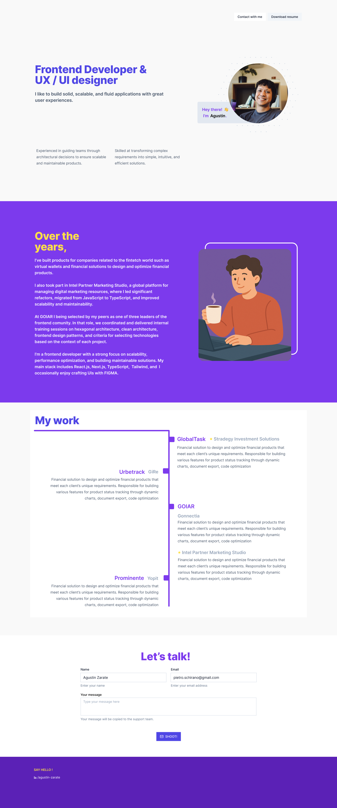

# Agustin Zarate - Personal Portfolio



A modern, responsive personal portfolio website showcasing my work as a Frontend Developer & UX/UI Designer.

## 🚀 Live Demo

[Visit my portfolio](https://agustinrzarate.dev) _(Coming soon)_

## 📋 About Me

Frontend developer with 5 years of experience building scalable and efficient solutions for various companies. I specialize in performance, interface design, and frontend architecture. I have also led teams, achieving excellent results in both product delivery and technical training. My strongest qualities are adaptability, persistence, and dedication. In my free time, I study markets, trade, and lift weights.

### Over the years:

I've built products for companies related to the fintech world such as virtual wallets and financial solutions to design and optimize financial products.

I also took part in Intel Partner Marketing Studio, a global platform for managing digital marketing resources, where I led significant refactors, migrated from JavaScript to TypeScript, and improved scalability and maintainability.

At GOIAR I was selected by my peers as one of three leaders of the frontend community. In that role, we coordinated and delivered internal training sessions on hexagonal architecture, clean architecture, frontend design patterns, and criteria for selecting technologies based on the context of each project.

## 🛠️ Technologies

### Current Stack

- **Frontend Framework**: React 18 with TypeScript
- **Build Tool**: Vite
- **Styling**: Tailwind CSS
- **UI Components**: Custom components with shadcn/ui
- **Development**: ESLint, TypeScript strict mode

### Planned Technologies

- **Backend**: Express.js with TypeScript
- **Database**: PostgreSQL with Prisma ORM
- **Authentication**: NextAuth.js or Auth0
- **Email Service**: Nodemailer or SendGrid
- **Deployment**: Vercel (Frontend) + Railway/Render (Backend)
- **Analytics**: Google Analytics 4
- **SEO**: Next.js with App Router (future migration)

## 🎨 Design

The portfolio features a clean, modern design with:

- **Color Scheme**: Purple accents with yellow highlights on white background
- **Typography**: Modern, readable fonts with clear hierarchy
- **Layout**: Responsive design optimized for all devices
- **UX**: Intuitive navigation and smooth user interactions

## 📁 Project Structure

```
src/
├── components/
│   ├── sections/          # Main page sections
│   │   ├── Hero.tsx      # Landing section
│   │   ├── About.tsx     # About me section
│   │   └── Work.tsx      # Portfolio projects
│   └── ui/               # Reusable UI components
│       ├── button.tsx
│       ├── Card.tsx
│       └── typography.tsx
├── assets/               # Images and static assets
├── lib/                  # Utility functions
└── App.tsx              # Main application component
```

## 🚀 Getting Started

### Prerequisites

- Node.js 18+
- pnpm (recommended) or npm

### Installation

1. Clone the repository

```bash
git clone https://github.com/agustinrzarate/agustinrzarate.dev.git
cd agustinrzarate.dev
```

2. Install dependencies

```bash
pnpm install
```

3. Start the development server

```bash
pnpm dev
```

4. Open [http://localhost:5173](http://localhost:5173) in your browser

### Build for Production

```bash
pnpm build
```

## 📝 Features

- ✅ Responsive design
- ✅ Modern React with TypeScript
- ✅ Tailwind CSS styling
- ✅ Component-based architecture
- ✅ ESLint configuration
- 🔄 Contact form (planned)
- 🔄 Blog section (planned)
- 🔄 Dark mode toggle (planned)
- 🔄 Performance optimization (planned)

## 🤝 Contributing

This is a personal portfolio project, but suggestions and feedback are welcome! Feel free to open an issue or submit a pull request.

## 📄 License

This project is open source and available under the [MIT License](LICENSE).

## 📞 Contact

- **Email**: pietro.schirano@gmail.com
- **LinkedIn**: [agustin-zarate](https://linkedin.com/in/agustin-zarate)
- **Portfolio**: [agustinrzarate.dev](https://agustinrzarate.dev)

---

_Built with ❤️ by Agustin Zarate_
